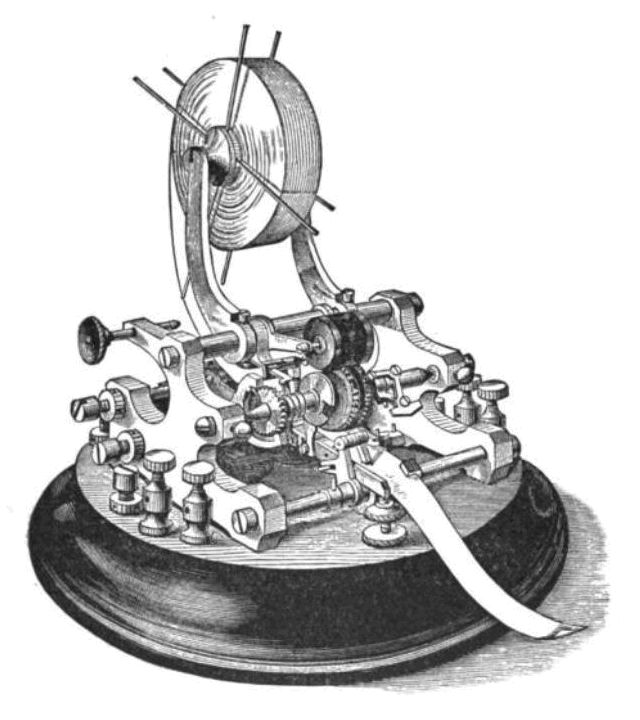

import { Head, Image } from 'mdx-deck'
import { Notes } from 'mdx-deck'
import Start from './src/Components/start'
import Source from './src/Components/source'
import Video from './src/Components/video'
export theme from './src/theme'
import Invert from './src/layouts/Invert'
import ImgLayout from './src/layouts/image'

<Head>
  <title>Interaction Design HF</title>
  <link href="https://fonts.googleapis.com/css?family=Work+Sans:400,700,900" rel="stylesheet" />
  <link href="./styles.css" rel="stylesheet" />
</Head>

export default Start

<Video
  loop={true}
  src="https://cdn.rawgit.com/signalwerk/talk.dock18.2018/add5d516/intro/intro.mp4"
/>

---

## *Infoabend*
# Interaction Design HF

Schule für Gestaltung, Zürich – 2018 <!-- .element: className="footer" -->

---
## **Stefan Huber** – Praxis & Dozent
---
## Dozierende

* **Berufsleute** mit Lehrauftrag
* **Spezialisten** vor Generalisten
* **Diversität** durch Vielfallt
---
# Warum?
---
export default ImgLayout

## Das Physische Medium wird überflüssig

<Source>

Börsentelegrafen, Thomas Edison, 1869

</Source>

---
export default ImgLayout

## Information reist schneller als ein Medium

Informationsübertragung nach London in km/h <!-- .element: className="small" -->

<Source>

A Farewell to Alms – A Brief Economic History of the World, Gregory Clark, Princeton University Press, 2007

</Source>

---
## *Fragestellungen*
# Wie unterstützt eine Gestaltung den User im digitalen Medium?

---
export default ImgLayout

## Grundsatz – Inhalt steht im Zentrum

<iframe
  className="browser"
  src="http://info.cern.ch/hypertext/WWW/TheProject.html">
</iframe>

<Source>

Erste Website – Tim Berners-Lee, 1991

</Source>

---
export default ImgLayout

## Gestaltung & Technologie folgen Inhalt

<Source>

Book Reader – Everyday Science and Mechanics, April, 1935 – Mikrofilm ab 1859

</Source>

---
export default ImgLayout

## Mobile Technologie

  

    <iframe
      width="560"
      height="315"
      src="https://www.youtube.com/embed/eywi0h_Y5_U?start=7&end=27"
    />
  

<Source>

Steve Ballmer – Reaktion auf iPhone von CEO Microsoft – 2007

</Source>

---
# Fremdbild

---

# Selbstbild

---
# Selbstbild

---
## IAD in Zürich
* Der Inhalt steht im Zentrum
* Typografie und Struktur sind zentrale Themen
* Die Gestaltung und Technologie soll den User unterstützen
* Fokus auf Webtechnologie

---
## Beispiel – HF IAD, 2017

<iframe
  className="browser"
  src="https://logrinto.github.io/IAD2017.schriftmuster/">
</iframe>

---
## Laotse
# Lernen ist wie Rudern gegen   den Strom. Hört man damit auf, treibt man zurück.

---
## Profil nach der Ausbildung

* Digitale Strategien erarbeiten
* Inhalt und Design für digitale Medien verknüpfen
* Planung und Kontrolle eines Produktionsteams
* Produktion erfordert zusätzliche Techniker

---
## Lohn

* [→ Statistik](https://signalwerk.github.io/IAD.Chart/)
---
## Facts & Figures

* 3 Jahre berufsbegleitend
* Unterrichtstage und Präsenzspflicht
* Laptop erforderlich
* Ausbildungskosten & Arbeitslast

---
## Lehrgang 2019
* **Anmeldeschluss** – 15. März 2019
* **Start** – 23. August 2019
---
## Aufnahmeverfahren
* Anmeldung mit Portfolio
* Hausaufgabe
* Aufnahmegespräch
* Zulassungsentscheid

---
## Aufwand
**1700 Lektionen** – Unterricht mit Diplomarbeit   
**1900 Lektionen** – Eigenarbeit und betriebliche Praxis

**3600 Lektionen**

---
## Themen

* Kontextwissen (200 Lektionen)
* Konzeption/Crossmedia (324 Lektionen)
* Design (264 Lektionen)
* Interaktion (280 Lektionen)
* Technologie (320 Lektionen)
* Management und Controlling (144 Lektionen)
* Thesis & Diplom

---
export default ImgLayout

## Lab

---
## Kontextwissen
* Medien-/Technologiegeschichte
* Kommunikationslehre/Medientheorie
* Copyright, Lizenzen & Recht
* Marktumfeld/Marktanalyse
---
## Konzeption/Crossmedia
* Konzeption
* Dramaturgie/Narration
* Recherche
* Crossmedia
---
## Design
* Typografie und Design
* Branding/Corporate Design
* Leseführung
---
## Interaktion
* Prototyping/Storyboard
* Interaction Design
* User Interface
* User Experience/Usability
* Interaktives Umfeld
---
## Technologie
* Grundlagen und Code
* Typografie und Technik
* Devices
* Suchmaschine & Statistiken
---
## Management & Controlling
* Agiles Arbeiten
* Resourcenplanung
* Kostenplanung
* Präsentation/Argumentation
---
## Stundenplan

<iframe
  className="browser"
  src="https://logrinto.github.io/IAD2017.timetable/">
</iframe>

---

## Milestones im Lehrgang
* **Prüfung** nach 1. Semester
* **Thesis** im 5. Semester
* **Diplom** im 6. Semester

---
# Beispiele
---
# Experimentelles Erzählen & LAB

* [→ Dokumentation Marc Hatt](http://harttaberflair.tk/erzaehlen.html)
* [→ Dokumentation Nadia Bendinelli](http://nadia-b.tk/)
* [→ Dokumentation Wolfgang Schoeck](http://tell-a-story.tk/Mach%20mal%20einen%20Punkt.html)

HF IAD, 2017 <!-- .element: className="footer" -->

---
# Grids & Modules

* [→ Projekt Pascale Anderegg](https://pascaleva.github.io/enroute/#1987)
* [→ Projekt Marc Hatt](https://marc-hatt.github.io/worte/home.html)
* [→ Projekt Lars Mäder](http://myjourney.larsmaeder.ch/#1)

HF IAD, 2017 <!-- .element: className="footer" -->

---
# Meetup – Web‑Worknights

---
# Meetup – Web‑Worknights

* ~~**05.10.2018** – Lightning Talk – [paper.js](http://paperjs.org/)~~
* ~~**26.10.2018** – Lightning Talk – [ramdajs](https://ramdajs.com/)~~
* ~~**09.11.2018** – Lightning Talk – Typografie vs. Web~~
* ~~**23.11.2018** – Lightning Talk – [React.js](https://reactjs.org/)~~
* **07.12.2018** – Lightning Talk – [Git](https://git-scm.com/  ) & [Github](https://github.com/)

Jeweils 17 – 20 Uhr, **um 18:30 Uhr Lightning Talk** (15 – 20 min) <!-- .element: className="footer" -->

---
# logrinto.ch
---
# Fragen?

---

# Merci

---

## exit 0;
