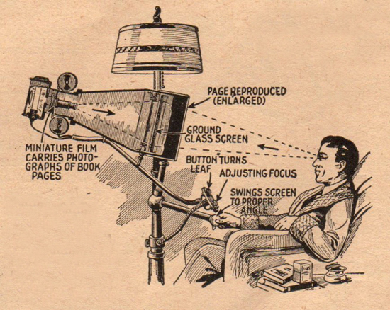
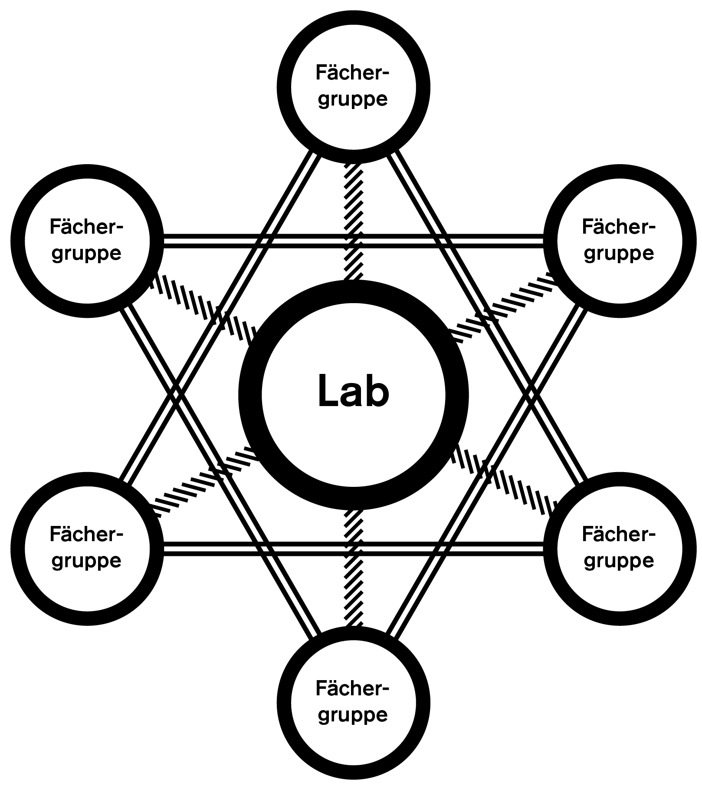

## Infoabend
# Interaction Design HF

Schule für Gestaltung, Zürich – 2018 <!-- .element: class="footer" -->

--s--
## Stefan Huber – Praxis & Dozent
--s--
## Dozierende

* Berufsleute mit Lehrauftrag
* Spezialisten vor Generalisten
* Diversität durch Vielfallt
--s--
# Warum?
--s--
## Das Physische Medium wird überflüssig

Börsentelegrafen, Thomas Edison, 1869 <!-- .element: class="footer" -->

--s--
## Information reist schneller als ein Medium

Informationsübertragung nach London in km/h <!-- .element: class="small" -->

A Farewell to Alms – A Brief Economic History of the World, Gregory Clark, Princeton University Press, 2007 <!-- .element: class="footer" -->

--s--
## Fragestellungen
# Wie unterstützt eine Gestaltung den User im digitalen Medium?

--s--
## Grundsatz – Inhalt steht im Zentrum

<iframe
class="browser" src="http://info.cern.ch/hypertext/WWW/TheProject.html" frameborder="0"></iframe>

Erste Website – Tim Berners-Lee, 1991 <!-- .element: class="footer" -->

--s--
## Gestaltung & Technologie folgen Inhalt

Book Reader – Everyday Science and Mechanics, April, 1935 – Mikrofilm ab 1859 <!-- .element: class="footer" -->

--s--
## Mobile Technologie

Steve Ballmer – Reaktion auf iPhone von CEO Microsoft – 2007 <!-- .element: class="footer" -->

  

    <iframe
      width="560"
      height="315"
      src="https://www.youtube.com/embed/eywi0h_Y5_U?start=7&end=27"
      frameborder="0"
      allowfullscreen
    />
  

--s--
# Fremdbild

--s--
# Selbstbild

--s--
# Selbstbild

--s--
## IAD in Zürich
* Der Inhalt steht im Zentrum
* Typografie und Struktur sind zentrale Themen
* Die Gestaltung und Technologie soll den User unterstützen
* Fokus auf Webtechnologie

--s--
## Beispiel

* [→ Schriftmuster HF 2017](https://logrinto.github.io/IAD2017.schriftmuster/)

HF IAD, 2017 <!-- .element: class="footer" -->

--s--
## Laotse
# Lernen ist wie Rudern gegen   den Strom. Hört man damit auf, treibt man zurück.

--s--
## Profil nach der Ausbildung

* Digitale Strategien erarbeiten
* Inhalt und Design für digitale Medien verknüpfen
* Planung und Kontrolle eines Produktionsteams
* Produktion erfordert zusätzliche Techniker

--s--
## Lohn

* [→ Statistik](https://signalwerk.github.io/IAD.Chart/)
--s--
## Facts & Figures

* 3 Jahre berufsbegleitend
* Unterrichtstage und Präsenzspflicht
* Laptop erforderlich
* Ausbildungskosten & Arbeitslast

--s--
## Lehrgang 2019
* **Anmeldeschluss** – 15. März 2019
* **Start** – 23. August 2019
--s--
## Aufnahmeverfahren
* Anmeldung mit Portfolio
* Hausaufgabe
* Aufnahmegespräch
* Zulassungsentscheid

--s--
## Aufwand
**1700 Lektionen** – Unterricht mit Diplomarbeit   
**1900 Lektionen** – Eigenarbeit und betriebliche Praxis  

**3600 Lektionen**

--s--
## Themen

* Kontextwissen (200 Lektionen)
* Konzeption/Crossmedia (324 Lektionen)
* Design (264 Lektionen)
* Interaktion (280 Lektionen)
* Technologie (320 Lektionen)
* Management und Controlling (144 Lektionen)
* Thesis & Diplom

--s--
## Lab

--s--
## Kontextwissen
* Medien-/Technologiegeschichte
* Kommunikationslehre/Medientheorie
* Copyright, Lizenzen & Recht
* Marktumfeld/Marktanalyse
--s--
## Konzeption/Crossmedia
* Konzeption
* Dramaturgie/Narration
* Recherche
* Crossmedia
--s--
## Design
* Typografie und Design
* Branding/Corporate Design
* Leseführung
--s--
## Interaktion
* Prototyping/Storyboard
* Interaction Design
* User Interface
* User Experience/Usability
* Interaktives Umfeld
--s--
## Technologie
* Grundlagen und Code
* Typografie und Technik
* Devices
* Suchmaschine & Statistiken
--s--
## Management & Controlling
* Agiles Arbeiten
* Resourcenplanung
* Kostenplanung
* Präsentation/Argumentation
--s--
## Stundenplan

* [→ online](https://logrinto.github.io/IAD2017.timetable/)

--s--

## Milestones im Lehrgang
* **Prüfung** nach 1. Semester
* **Thesis** im 5. Semester
* **Diplom** im 6. Semester

--s--
# Beispiele
--s--
# Experimentelles Erzählen & LAB

* [→ Dokumentation Marc Hatt](http://harttaberflair.tk/erzaehlen.html)
* [→ Dokumentation Nadia Bendinelli](http://nadia-b.tk/)
* [→ Dokumentation Wolfgang Schoeck](http://tell-a-story.tk/Mach%20mal%20einen%20Punkt.html)

HF IAD, 2017 <!-- .element: class="footer" -->

--s--
# Grids & Modules

* [→ Projekt Pascale Anderegg](https://pascaleva.github.io/enroute/#1987)
* [→ Projekt Marc Hatt](https://marc-hatt.github.io/worte/home.html)
* [→ Projekt Lars Mäder](http://myjourney.larsmaeder.ch/#1)

HF IAD, 2017 <!-- .element: class="footer" -->

--s--
# Meetup – Web‑Worknights

--s--
# Meetup – Web‑Worknights

* **05.10.2018** – Lightning Talk – [paper.js](http://paperjs.org/)
* **26.10.2018** – Lightning Talk – [ramdajs](https://ramdajs.com/)
* **09.11.2018** – Lightning Talk – Typografie vs. Web
* **23.11.2018** – Lightning Talk – [React.js](https://reactjs.org/)
* **07.12.2018** – Lightning Talk – [Git](https://git-scm.com/  ) & [Github](https://github.com/)

Jeweils 17 – 20 Uhr, um 18:30 Uhr Lightning Talk (15 – 20 min) <!-- .element: class="footer" -->

--s--
# logrinto.ch
--s--
# Fragen?

--s--
# Danke
--s--

--s--
(end)

--s--
